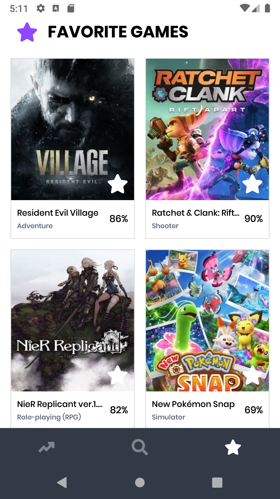

# GameBank

### Task Overview

- [x] Trending Games
- [x] Search
- [x] Favorite

### Known bugs:
- [ ] After fetching from api then reloading from database the games won't all be in the same order. This will cause a quick shift. Perhaps sorting after fetching from api can help.

### Running Instructions
- Add API keys to local.properties
  - CLIENT_ID, TOKEN

### APK
- [apk](game_bank.apk)

### Preview

|Trending Games |Search | Favorite|
--- | --- | ---
| |

### Possible Improvements
- [ ] Right now all video games are being reloaded when the a change is made to a video game (is favorite or not) perhaps I can only change local field and save to db and not referesh whole recycler view.
- [ ] Properly handle authorization token
- [ ] Currently only fetching from api once in trending then relying on database. This has many ways in which it can be improved like refreshing data at every launch.

